# Extension

다른 앱이나 시스템과 상호 작용할 때 사용되며 (iOS 8+, 앱 to 앱 전환의 불편함 해소), 

구현 과정에서 많은 규칙과 가이드라인을 따라야 한다.


#### 익스텐션이란?

정확히는 익스텐션 컨테이너 (Extension Container)

- 앱이 아니다
- 애플 Framework 코드를 통해서만 접근
- App to app 통신이 아니다. 
- 빌드될때 추가적인 타겟을 통해 따로 빌드되며 설치될때는 앱과 같이 설치 (바이너리도 앱과 독립적)
- 실행시에도 앱과는 독립된 프로세스로 실행 (완전히 다른 주소공간)
- 라이프 사이클
  1. 사용자가 app extension 선택
  2. 시스템이 app extension 실행
  3. app extension 코드 실행
  4. 시스템이 app extension 종료


한마디로 익스텐션은 Apple Framework 을 통해서 호출되는 기능들의 집합이라고 할 수 있다. 

( 호스트앱이 다이렉트로 익스텐션을 호출하지 못한다. 실행이 Appel Framework에 의해 된다는 사실을 제외하

앱과 거의 동일한 형태를 가진다. )

> Containing App : 익스텐션을 생성하고 포함한 앱
>
> Host App : 익스텐션을 호출한 앱

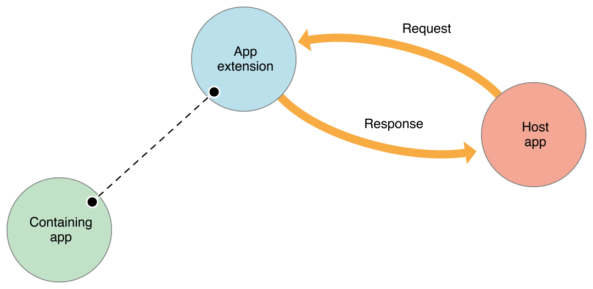

#### 앱과 익스텐션 간 데이터 공유 방법

기존의 앱과 데이터를 주고 받을 상황에서 iOS 특성상 SankBox 로 각각 분리되어 있어 데이터를 주고 받기 어렵게 되어 있음.

Today 익스텐션 처럼 Containing App 번들에 포함되어 있는 구조지만, app extension 과 containing app 은 각자의 컨테이너에 직접 접근할 수 없다. 대신 shared container를 통해 데이터 공유를 가능하게 할 수 있다. 

공유되는 데이터를 읽고쓰는 경우 동기화(synchronization) 가 필수적이다. 

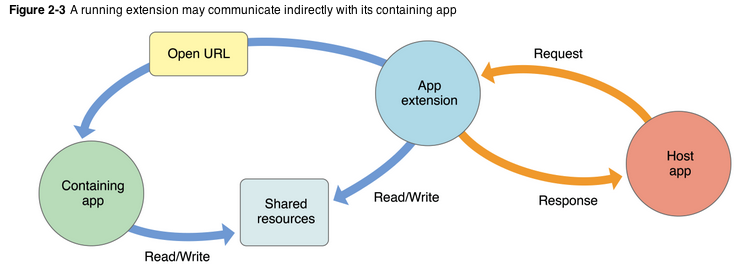


#### App Groups 설정

App extension 과 Containing app 이 서로의 데이터를 공유하기 위해 하나의 groupID를 가진 공용 컨테이너에서 공유할 수 있다. 

우선 containing app 의 Capabilities > App Groups 활성화 > '+' 버튼으로 새로운 컨테이너 생성 

extension target 을 선택하고 동일한 컨테이너에 체크한다. 

이로써, containing app 과 extension app 은 하나의 app group에 속하게 되어 데이터를 공유할 수 있다. 

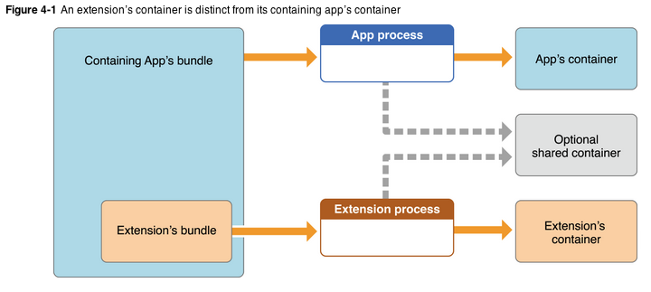

1. NSUserDefaults

   공유하고자하는 데이터가 간단할 경우 UserDefaults 사용하며, 일반적으로 사용하는 standard 대신 suiteName: 생성자(objective-c : initWithSuiteName)로 별도의 UserDefaults 를 생성하여 사용. 생성자의 파라미터는 group 컨테이너의 ID를 전달.

```
Read: 
if let groupUserDefaults = UserDefaults(suiteName: "group.com.raonsecure.ExtensionToday") {
  groupUserDefaults.set("theAccountName", forKey: "lastAccountName")
}

Write:
if let groupUserDefaults = UserDefaults(suiteName: "group.com.raonsecure.ExtensionToday") {
  let account = groupUserDefaults.object(forKey: "lastAccountName")
  print("lastAccountName:\(String(describing: account))")
}
ShareViewController 의 isContentValid() 함수에서 데이터를 넘겨 받는다. 
configurationItems() 함수에서 화면UI 변경이 가능하다.
didSelectPost() 함수는 화면 상단 [Post] 버튼을 눌렀을 때 동작 (Userdefaults 에 저장, 데이터 타입 검사 등을 작업)
```

- `addAllIdentificationPhoneNumbers`

  전화번호에 정보 추가

- `addAllBlockingPhoneNumbers`

  차단할 전화번호 추가

- 정보추가와 차단 메소드 사용법은 동일하며 allPhonenumbers, label 변수에 추가하면된다. 

  (주의할 점은 allPhoneNumbers 에 추가되는 번호는 오름차순으로 추가해야한다.)

  ```
  let allPhoneNumbers: [CXCallDirectoryPhoneNumber] = [ 821099046635, 821099046639 ]
  let labels = [ "Alex Han", "Local business" ]
  ```

  https://ehdrjsdlzzzz.github.io/2018/10/03/App-Extension-Programming-Guide-1/

  https://m.blog.naver.com/PostView.nhn?blogId=horajjan&logNo=220341965085&proxyReferer=https%3A%2F%2Fwww.google.com%2F

  

  - 정리잘됨 : http://g-y-e-o-m.tistory.com/91
  - 개념 : (https://www.letmecompile.com/extensions-for-macos-10-10-ios-8/)
  - App Groups ([https://medium.com/@flatcherlynd/ios-%EC%95%B1%EA%B3%BC-extension%EA%B3%BC%EC%9D%98-%EB%8D%B0%EC%9D%B4%ED%84%B0-%EA%B5%90%ED%99%98-3893b0fdf10e](https://medium.com/@flatcherlynd/ios-앱과-extension과의-데이터-교환-3893b0fdf10e))
  - Action Extension (https://medium.com/@ales.musto/simple-text-action-extension-swift-3-c1ffaf3a197d)
  - Share Extension (http://www.yudiz.com/share-extention-in-ios-app/)

  

  

  - 익스텐션 프로그래밍 가이드

    https://developer.apple.com/library/archive/documentation/General/Conceptual/ExtensibilityPG/index.html#//apple_ref/doc/uid/TP40014214-CH20-SW1

  - 익스텐션 개요 슬라이드

    https://www.slideshare.net/qohj/extension-in-ios

  - 익스텐션 info.plist 의 key 목록 

    https://developer.apple.com/library/content/documentation/General/Reference/InfoPlistKeyReference/Articles/AppExtensionKeys.html

  - Today 익스텐션 이미지 

    https://hackernoon.com/app-extensions-and-today-extensions-widget-in-ios-10-e2d9fd9957a8

  - Today 익스텐션 개요

    https://medium.com/ios-os-x-development/today-extension-in-ios-swift-4-51770f44633a

  - 앱 익스텐션간 데이터 공유

    https://oaksong.github.io/2018/06/16/sharing-data-between-app-extension-and-containing-app/

  - 포토에디팅 익스텐션 예제 

    https://goo.gl/YV9UkZ

  - 커스텀키보드 개요 

    https://medium.com/mackmobile/custom-keyboard-tutorial-ef0c50906f5e

  - 커스텀키보드 예제 (서비스키)

    https://medium.com/swift-india/creating-a-custom-keyboard-in-ios-a75e7d5cc5ef

  - iMessage 익스텐션

    https://developer.apple.com/kr/imessage/

  - iMessage 예제 (게임)

    https://github.com/brtjkzl/checkers

  - message filter 익스텐션 개요

    https://developer.apple.com/documentation/sms_and_call_reporting/sms_and_mms_message_filtering

  - message filter 익스텐션 예제

    https://medium.com/@payalmaniyar/create-message-spam-filter-extension-for-ios-11-df554908d776

  - 네트워크 익스텐션 개발자 문서 

    https://developer.apple.com/documentation/networkextension

  - 네트워크 익스텐션 WWDC

    https://developer.apple.com/videos/play/wwdc2017/707

    https://developer.apple.com/videos/play/wwdc2017/709/

    https://developer.apple.com/videos/play/wwdc2015/717/

  - 컨텐츠 차단 익스텐션

    https://medium.com/@nderkach/how-to-build-a-simple-tracker-blocker-for-ios-cc6c52a2d2d1

  - 노티피케이션 서비스 익스텐션 개요

    [http://rhammer.tistory.com/tag/%ED%91%B8%EC%89%AC](http://rhammer.tistory.com/tag/푸쉬)

  - 노티피케이션 서비스 익스텐션 이미지 푸시 예제

    https://taesulee.tistory.com/4

  ## 참고

  

  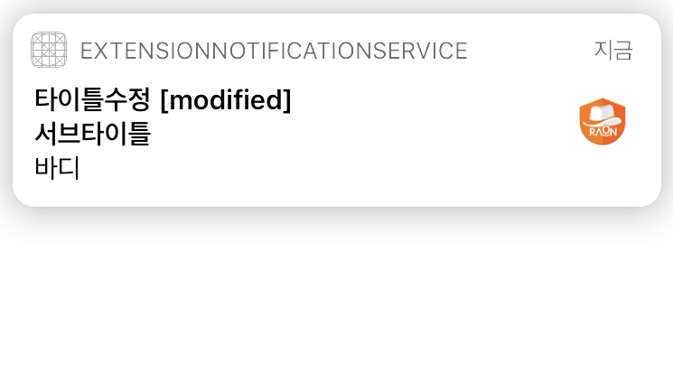

  또한, UNUserNotificationCenter 사용 시 앱 실행중에도 상단 알림바에 푸쉬내용을 표시할 수 있다. 

  이미지 푸쉬를 보내거나 사용자에게 전달되기 전에 푸쉬 내용을 수정할 수 있는 익스텐션

  > iOS 10

  ## Notification Service Extension

  

  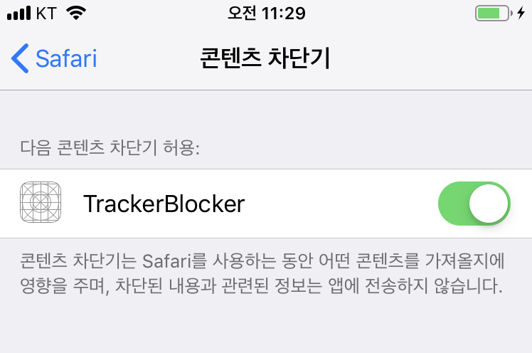

  iOS 9이상의 사파일에서 페이지를 불러오기 전에 컨텐츠 필터 기능을 할 수 있는 익스텐션

  > iOS 9 safari

  ## Content Blocker Extension

  

  (1) VPN 프로파일이나 루트 인증서를 통해 서드파티 앱 광고를 막아서는 안 된다는 애플 가이드라인 (2) 또 공개 API는 본래 용도에 맞게 사용되어야 한다는 규정이 있기 때문이라고 합니다. 애드가드는 실제 VPN을 이용하지 않으나, 대신 NEPacketTunnelProvider라는 공개 API를 활용해 가상 VPN을 만들어 광고를 차단합니다. 그러나 가이드라인에 따르면 이 API는 실제 VPN 서버에 연결할 때만 이용해야 하므로 애드가드 방식은 규정을 위반한 것이 되는 것입니다

  

  - Apple 의 샘플 프로젝트 : https://developer.apple.com/library/archive/samplecode/SimpleTunnel/Introduction/Intro.html

  - AtoZ (서버포함): https://github.com/lxdcn/NEPacketTunnelVPNDemo

  - sample : https://github.com/agrinman/sift-ios

  - release app error : NEConfigurationErrorDomain Code=10 "permission denied"

    answer : https://forums.developer.apple.com/thread/88000

  - NEFilterProvider 는 supervised 모드에서만 가능!!!!

  - 클래스 정리 : http://kean.github.io/post/network-extensions-into

  

  ------

  

  NEHotspotConfiguration (iOS 11) API 는 앱에서 핫스팟을 구성할 수 있다. 

  NEHotspotHelper (iOS 9) API는 와이파이 사용자 인증을 수행할 수 있는 기능을 제공한다. 

  #### Wi-Fi 핫스팟 인증 및 구성

  

  NEDNSProxyProvier (iOS 11, supervised devices) API 는 네트워크 트래픽을 모두 차단 할 수 있으며, 사용자 지정 DNS 프로토콜을 사용할 수 있다. (DNS 하이재킹 방지를 위한 기술)

  #### DNS Proxy

  

  `NEFilterProvider` (iOS 9, supervisored devices) API 는 iOS 기기에서 네트워크 트래픽을 필터링 할 수 있는 기능을 제공한다. (모바일 데이터와 WiFi 둘다 동작)

  #### On-Device Network Contents Filter

  

  - `NEPacketTunnelProvider` (iOS 9)는 VPN 서버와의 연결을 설정하고 터널을 구성한 다음 가상 네트워크 인터페이스에서 들어오는 IP 패킷을 읽고 VPN 서버로 보낸다.
  - `NEAppProxyProvider` (iOS 9, supervisored devices, managed app 만 해당)는 NEPacketTunnelProvider 와 매우 유사하지만 IP 수준 대신 TCP/UDP 레벨에서 동작한다.

   `NETunnelProvider` (iOS 9) 에서 제공되는 API는 사용자 정의 네트워크 터널링 프로토콜 (ex. VPN 프로토콜)의 클라이언트측을 구현할 수 있다.

  #### Network Tunneling Protocol Client-Side

  

   `NEVPNManager` (iOS 8) 에서 제공되는 API는 VPN 구성을 생성하고 관리할 수 있는 기능

  #### Personal VPN

  

  예를 들어 `NEDNSProxyProvider` 는 supervisored devices 에서만 사용할 수 있지만 개발자 라이브러리는 이를 언급하지 않는다. 

  일부는 iOS 11에서만 사용할 수 있으며, 주의할 점은 일부 확장 기능은 supervisored devices 에서만 사용하도록 제한되어 있으므로 제한사항에 대해 미리 알고 있는 것이 좋다. 

  OS의 core network 기능들을 사용자 정의하여 사용할 수 있는 API 를 제공한다. 

  ## Network Extension

  

  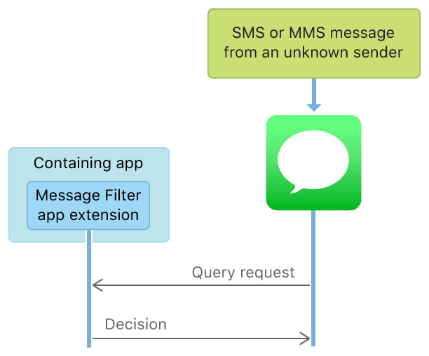

  메시지가 원하지 않는지 확인하기 위해 메시지 앱은 현재 활성화 된 메시지 필터 앱 확장을 실행하고 메시지를 쿼리한다.

  알수없는 발신자로부터 메시지를 받았을 때, 메시지 앱이  원치않는지 여부를 판단하도록 요청할 수 있는 익스텐션

  > iOS 11

  ## Message Filter Extension

  

  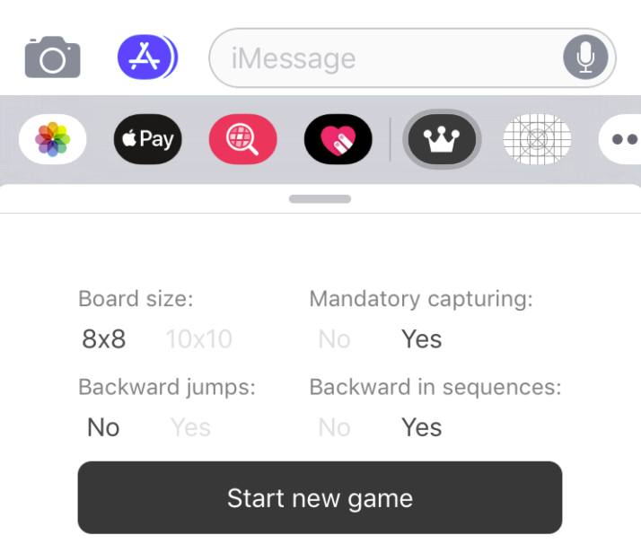

  메시지앱을 나가지 않고도 다른 앱과 상호 작용할 수 있는 익스텐션

  > iOS 10

  ## iMessage Extension

  

  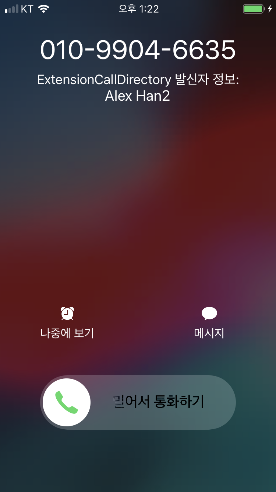

수신자 전화번호를 식별하고 차단할 수 있는 익스텐션

> iOS 10.0

## Call Directory Extension


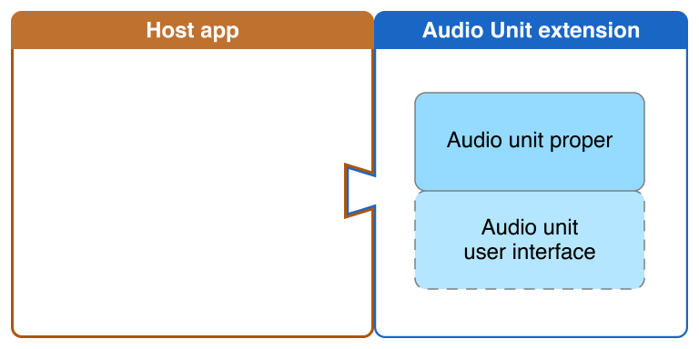

오디오 스트림을 생성하거나 호스트 앱에서 오디오 스트림을 수정할 수 있는  익스텐션

> iOS 9.0 

## Audio Unit Extension


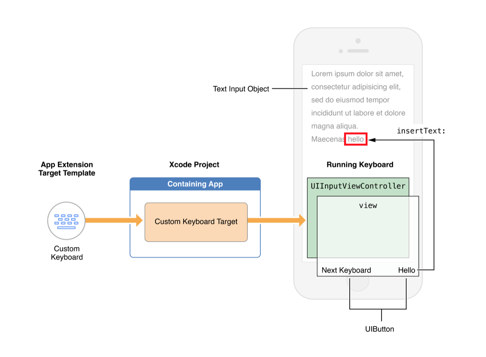

익스텐션 Info.plist 파일에 RequestsOpenAccess 값(YES)을 변경하여 키보드 목록에 표시 할 수 있다. 

키보드를 커스텀마이징 해서 여러 앱 상에서 사용 가능하도록 하는 익스텐션

> iOS 8

## Custom Keyboard Extension


- Document Picker View Controller 
- File Provider 

파일을 가져오거나 열어서 서버에 업로드 및 다운로드 할 수 있다. 

Containing app 안에 있는 파일을 Host app 이 조작할 수 있는 익스텐션.  (Import, Export, Open, Move)

> iOS 8

## Document Provider Extension


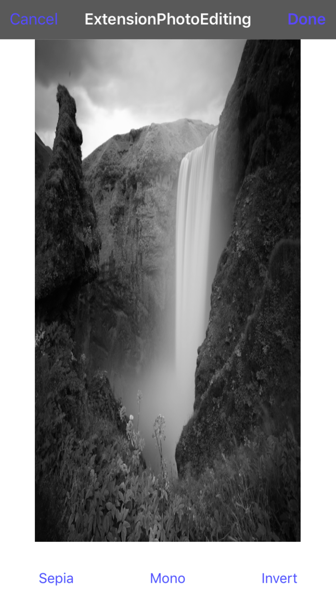

단말 Photos 앱 실행 후 선택된 사진에서 편집 선택 후 photo Extension 을 사용할 수 있다.

- `startContentEditingWithInput:`

  사용자가 익스텐션 선택 시 호출됨. 

  사용자가 익스텐션을 열기 전 선택했던 이미지을 받을 수 있음.

  이 이미지에 필터와 다른 효과를 적용할 수 있음.

  PHContentEditingInput 객체에서 이미지와 메타데이터 정보를 가져올 수 있음.

- `finishContentEditingWithCompletionHandler:`

  editing 완료 되었을 때 호출됨. ('Done' 버튼)

- `canHandleAdjustmentData:`

  최근 편집 작업을 계속할 수 있는지 여부

- `cancelContentEditing:`

  editing 취소 시 호출됨.

  

PhotoEditingViewController 클래스를 상속 받고 아래 4개의 메소드가 반드시 필요

PhotoKit 의 주요한 프레임웍은 2개가 있다. (Photo framework and Photo UI framework)

사진앱(iOS 기본앱)에서 사진이나 동영상을 편집하는 익스텐션

> iOS 8

## Photo Editing Extension


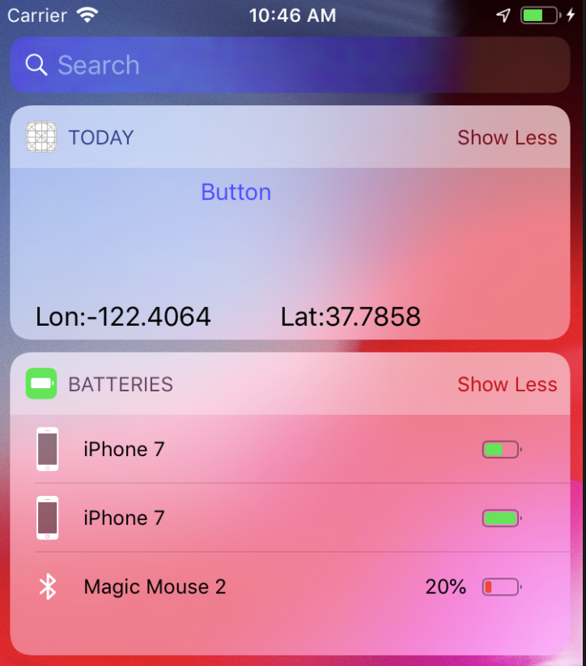

- TodayViewController : Today 익스텐션 화면 위젯을 나타내는 뷰컨트롤러에 대한 소스

  위젯 UI를 만들고, 표시할 정보(ex. GPS정보)를 가져온다. 

  시스템은 최신 데이터가 표시되도록 일정 간격으로 widgetPerformUpdate(completionHandler:) 델리게이트 메소드를 호출한다. 

- MainInterface.storyboard : Today 위젯 화면의 사용자 인터페이스를 담고 있는 스토리보드

- Info.plist : 익스텐션을 위한 설정 리스트 

프로젝트에 Today 익스텐션 타겟을 추가하면, 알림화면에 하나의 위젯이 추가된다. 


호스트앱 내부에서 실행되므로 기존 앱 라이프사이클를 거치지 않는다. 

앱을 기동하지않고 해당 앱의 일부 기능들을 간이 형식으로 쓸수 있게하는 익스텐션 (위젯이라고도 부름)

> iOS 8

## Today Extension (Widget)


- UserDefault (key:value)
- Capabilities > App Groups 활성화 > identifier 생성

앱 <-> 익스텐션간의 뷰 이동은 불가능, 데이터 공유 방법 (설정)


호출하는 앱(HostApp)과 호츨받는 앱(ContainingApp) 구현에서 타겟을 Share Extension 으로만 변경해서 사용


컨텐츠 (텍스트, 사진 등)을 공유하기 눌렀을때, 호출되는 앱에 쉽게 공유할 수 기능

Host app 에 있는 공유 버튼을 눌러 정보를 SNS 등으로 타 유저와 공유하는 익스텐션

> iOS 8

## Share Extension 


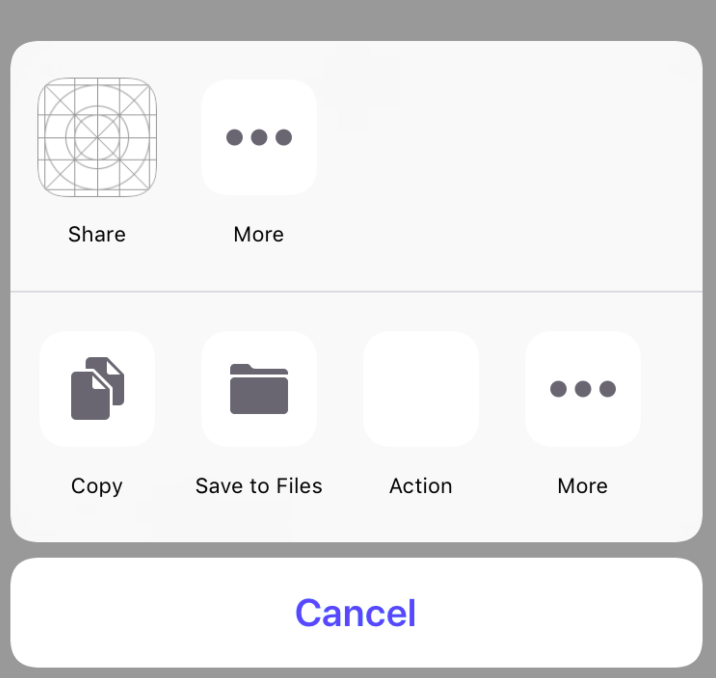

액션을 선택하면 액션 전용 뷰컨트롤러가 열리는 개념이다.

Host app 상에서 표시되는 컨텐츠를 조작 혹은 표시하는 익스텐션

> iOS 8

## Action Extension 


- 헤더파일에 `NS_EXTENSION_UNAVAILABLE` 매크로가 붙어있는 API는 사용할 수 없다.
- 카메라와 마이크는 사용할 수 없다.
- 백그라운드 상에서 장시간 태스크를 실행할 수 없다. 
- AirDrop 을 사용해서 데이터를 송수신 할 수 없다. 

#### 주의사항 (Extension 상에서 사용할 수 없는 API)


- 액션 익스텐션 (Action Extension) : 호스트 앱과 상호작용
- 공유 익스텐션 (Share Extension) : 컨텐츠 (텍스트, 사진 등)을 공유
- 투데이 익스텐션 (Today Extension) : 위젯 사용
- 사진 편집 익스텐션 (Photo Editing Extension)
- 오디오 유닛 익스텐션 (Audio Unit Extension) : 오디오 스트림을 생성, 수정하여 호스트 앱에 전송
- 전화번호부 익스텐션 (Call Directory Extension) : 전화번호를 통해 발신자를 식별, 차단
- 파일 익스텐션 (Document Provider Extension) : 파일 저장소의 접근과 관리 권한을 처리
- 인텐트 익스텐션 (Intents Extension) : Siri 지원에 관련된 작업을 처리 
- 인텐트UI 익스텐션 (Intents UI Extension) : Siri 또는 지도(maps) 인터페이스를 정의 할 수 있음.
- 스포트라이트 익스텐션 (Spotlight Extension) : 앱이 실행중이 아닐 때 앱의 컨텐츠의 인텍스를 지정
- 스티커팩 익스텐션 (Sticker Pack Extension) : 사용자가 메시지 앱에서 사용
- 네트워크 익스텐션 (Network Extension) : VPN 생성, 컨텐츠 필터링
- 컨텐트 차단 익스텐션 (Content Blocker Extension) : 사파리에서 콘텐츠를 처리 방식을 설정
- 알림 서비스 익스텐션 (Notification Service Extension) : 푸쉬 페이로드를 가로채 데이터를 재구성
- 알림 컨텐트 익스텐션 (Notification Content Extension) : 푸쉬 화면을 3D 터치하여 보는 상세화면을 구성할 수 있음.
- 브로드캐스트 업로드 익스텐션 (Broadcast Upload Extension) : 동영상 또는 오디오 스트리밍 정송
- 브로드캐스트 UI 익스텐션 (Broadcast UI Extension) : 스트리밍 요청 시 화면 구성을 할 수 있음.
- 메시지 익스텐션 (iMessage Extension) : 메시지 앱과 상호작용
- 메시지 필터 익스텐션 (Message Filter Extension)

#### 애플에서 허용한 익스텐션 종류


info.plist 에는 현재 어떤 형태의 데이터를 다룰 수 있는지, 동일한 데이터들이 여러개 선택되었을때 최대 몇개까지 처리가능한지 등의 정보를 미리 정의해 두어야 한다.`NSExtension` 속성값 아래에 `PrincipalClass`,  `RoleType` 등을 적절히 정의하도록 하자

#### 익스텐션을 위한 info.plist 설정


1. Keychain 공유

   번들 시드 ID (bundle seed identifier, bundle identifier prefix, teamID)만 같으면 앱/앱 간에도 키체인 공유하는것이 기존에도 가능했다. 익스텐션에도 동일하게 적용되며, 엑세스 그룹에 bundle seed ID가 같게 되어 있으면 공유가 가능


1. CoreData 또는 sqlite

   기본적인 동기화는 제공되며, 커스터마이즈 하고 싶으면 inter-process(앱-익스텐션간) 동기화 방법을 제공하는 `NSFileCoordination` 을 이용한다. 

   데이터가 복잡하거나 이미지와 같은 파일이라면 FileManager를 사용